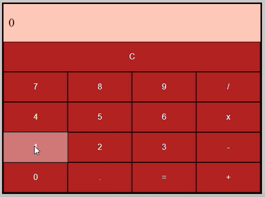
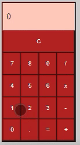

<h1 align="center"> Calculadora em React </h1>

<h2 align="center">Descrição do projeto </h2>

Um Projeto da trilha React da Dio, que teve o desafio de codificarr as funções de Multiplicar(*) Dividir(/) e tomado a iniciativa de estilizar. 

 

Imagem 1 Computador: 

 

Imagem 2 Celular: 

 

<h2 align="center"> Funcionalidades do projeto </h2>

-  ``Funcionalidade :`` CALCULADORA.

 

<h2 align="center"> Acesso ao projeto </h2>

 Você pode acessar o projeto final clicando aqui: https://dniemeryers.github.io/trilha-react-desafio01-calculadora/ 

 
<h2 align="center">  Tecnologias utilizadas </h2>

-  ``REACT``

<h2 align="center"> Extensões utilizadas </h2>

- ``styled-components``

 
<h2 align="center"> Pessoas desenvolvedoras do projeto </h2>

|  Diego Niemeyer |  Dio._ |
| :---: | :---: |

